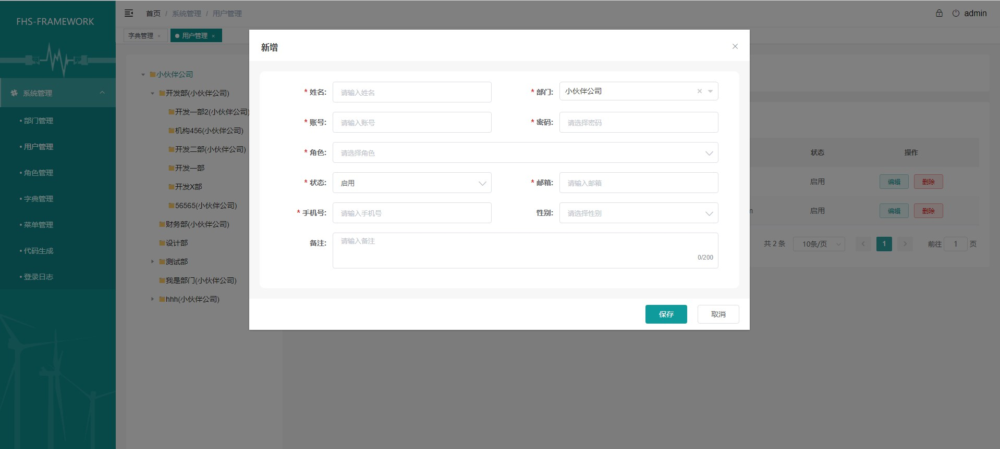
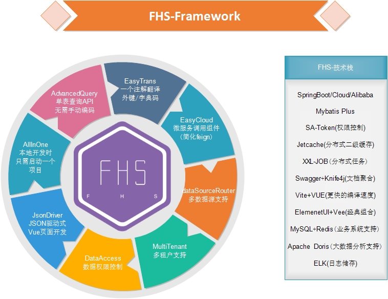

<p align="center">
    
    <br>      
    <br>      
    <p align="center">
         FHS-Framwork是一个集成了国内外诸多优秀开源项目的快速开发平台，除了在常规快速开发平台提供 用户，角色，权限，菜单，字典，审计日志，代码生成器 还拥有可以让您更少写SQL和前端代码的翻译服务以及PAGEX服务。
        <br>      
        <br>      
        <span>
            <span>
                FHS-Framwork官方交流群：976278956
            </span>
        </span>
        <br>
        <br>
        <a href="https://vitejs.cn/">
            
        </a> 
        <a href="https://cn.vuejs.org/">
            
        </a> 
 <a href="https://element.eleme.cn/">
            
        </a> 
        +
        <a href="http://spring.io/projects/spring-boot">
            
        </a>
         <a href="http://spring.io/projects/spring-boot">
            
        </a>
        <a href="http://mp.baomidou.com">
            
        </a>  
        <a href="http://ibeetl.com/">
            
        </a> 
    </p>
</p>

-----------------------------------------------------------------------------------------------
# 体验地址(求star)

http://82.157.62.164/login   admin  123456


# 预览图


# 3. 技术栈


# 4. 和其他框架差异化特性
## - &#8194;&#8194;&#8194;&#8194;翻译组件
&#8194;&#8194;&#8194;&#8194;&#8194;&#8194;&#8194;&#8194;翻译组件可以只通过注解把你表里的id转换为名称，把你的字典码转换为字典注释(比如0转换为男1转换为女)，详情见：https://gitee.com/fhs-opensource/easy_trans
## - &#8194;&#8194;&#8194;&#8194;All in One模式 开发 微服务模式部署
&#8194;&#8194;&#8194;&#8194;&#8194;&#8194;&#8194;&#8194;微服务开发对于电脑内存要求比较高，调试个东西要启动好多个微服务还要启动网关，调用链路复杂的点一下不知道调用到谁那里去了，要解决还要自己机器跑nacos，fhs 首创，all in one 模式开发，微服务模式部署，在开发环境直接把所有的模块集成到一个springBoot项目启动，部署的时候又使用微服务+网关模式部署  参考：fhs_app/fhs_app_all_in_one 和  fhs_app/fhs_app_basics的做法 即可实现。
## - &#8194;&#8194;&#8194;&#8194;更简单的微服务调用
&#8194;&#8194;&#8194;&#8194;&#8194;&#8194;&#8194;&#8194; 传统微服务玩法是第一我定义一个fegin api接口，然后写一个controller ，在写一个service实现 需要三个步骤，fhs 集成了easy cloud，只需要在service层给对应的方法上加@CloudMethod 即可完成接口暴露，哪个微服务用到直接 Autowired service接口即可。详情：https://gitee.com/fhs-opensource/easy_cloud

## - &#8194;&#8194;&#8194;&#8194;更好用的校验框架
&#8194;&#8194;&#8194;&#8194;&#8194;&#8194;&#8194;&#8194;集成了validate-springboot-starter，在兼容hibernate Validator和javax validation的同时，支持了更多自定义玩法。
内置常用验证规则：比如手机号验证，正则验证，ip,邮箱，长度，范围，数字，小数，中国车牌号，身份证，长度， url, 图书ISBN编号,文件后缀,文件大小 等常用验证规则


## - &#8194;&#8194;&#8194;&#8194;JSON驱动的VUE 列表和表单组件
&#8194;&#8194;&#8194;&#8194;&#8194;&#8194;&#8194;&#8194;avue今年又获得了GVP，证明了越来越多的前端程序员开始接受JSON驱动来写VUE 页面，fhs 也将组件封装为JSON驱动的组件，比如简单的CRUD，就可以这么写：
```html
<template>

    <pagex-crudForm :namespace="namespace" :title="title" :crudSett="crudSett" :formSett="formSett" :idFieldName="idFieldName" >
    </pagex-crudForm>

</template>

<script>

export default {
  name: "Dict",
  data() {
    return {
      namespace:'dictGroup',
      title:'字典分组',
      idFieldName:'groupId',//主键
      crudSett:{ // 列表配置
        api: '/basic/ms/dictGroup/pagerAdvance', //列表接口
        sortSett: [{//排序
          "direction": "DESC",
          "property": "updateTime"
        }],
        buttons: [//列表上的按钮
          {
            title: '新增',
            name: 'add',
            code: "add",
            type: 'primary',
            size: 'mini',
            icon: 'el-icon-plus', // 支持写click 自定义点击事件，新增组件会自带事件
          }
        ],
        columns: [
          {label: '分组名称', name: 'groupName'},//列 分组名称
          {//分组编码列，点击之后跳转到字典项列表
            label: '分组编码', name: 'groupCode', type: 'formart',
            formart: "<label style='cursor:pointer'>${groupCode}</label>",//格式化显示效果
            click: function (_row) {
              this.$router.push({path: '/dict/type/data/',query:{groupCode: _row.groupCode}});
            }
          },
          {
            label: '操作',//操作列
            name: 'operation',
            type: 'textBtn',
            textBtn: [
              {
                title: "编辑",
                type: "bottom",
                size: 'mini'
              },
              {
                title: "详情",
                type: "success",
                size: 'mini'
              },
              {
                title: "删除",
                type: "danger",
                size: 'mini',
                api: '/basic/ms/dictGroup/'
              }
            ],
          }
        ],
        filters: [//过滤条件
          {label: '分组名称:', name: 'groupName', placeholder: "分组名称", type: 'text', operation: 'like'},//like 是后台过滤规则，模糊匹配 支持> < != between like 等等
          {label: '分组编码:', name: 'groupCode', placeholder: "分组编码", type: 'text', operation: 'like'}
        ],
      },
      formSett:{// 表单
        addApi: '/basic/ms/dictGroup/',//新增表单的url，默认的post 
        updateApi: '/basic/ms/dictGroup/',//修改表单的url 默认是post
        data:{
           //这里写默认值，比如groupName:'默认编码'
        },
        controls:[//表单字段
          {
            type: 'text',
            name: 'groupName',
            label: '分组名称',
            rule: 'required',
            placeholder: '请输入分组名称'
          }, {
            type: 'text',
            name: 'groupCode',
            label: '分组编码',
            rule: 'required',
            placeholder: '请输入分组编码'
          }
        ]
      },
    }
  },
  methods: {
     //自定义方法
  }
};
</script>

```


# 使用说明

 &#8194;&#8194;&#8194;&#8194;1  新出炉的文档 http://fhs-opensource.top/components/readme.html
 
 &#8194;&#8194;&#8194;&#8194;2  word格式的文档 在sql&docs目录
 
 &#8194;&#8194;&#8194;&#8194;3  quik start
 
 &#8194;&#8194;&#8194;&#8194; A 准备好redis和mysql <br/>
 &#8194;&#8194;&#8194;&#8194; B 创建数据库，导入sql&docs 下的fhs-demo.sql （如果遇到部分sql执行失败，请手动执行） <br/>
 &#8194;&#8194;&#8194;&#8194; C 修改fhs_app/fhs_app_all_in_one/src/main/resources/application.yml redis(2处，jetcache和spring的redis)和mysql配置 <br/>
 &#8194;&#8194;&#8194;&#8194; C 启动fhs_app/fhs_app_all_in_one/src/main/java/com/fhs/app/SingleApplication.java <br/>

&#8194;&#8194;&#8194;&#8194; 如果遇到下载不了的jar，请使用中央仓库官方地址：https://repo1.maven.org/maven2/ 阿里云的easycloud core 好像down不下来，或者手动下载下来放到本地仓库目录中。
 
 &#8194;&#8194;&#8194;&#8194;4  视频:<br/>
&#8194;&#8194;&#8194;&#8194;https://www.bilibili.com/video/BV1DK4y1s7AL/  基础介绍和翻译服务使用<br/>
&#8194;&#8194;&#8194;&#8194;https://www.bilibili.com/video/BV1eh411o7Td/  新项目使用fhs<br/>
&#8194;&#8194;&#8194;&#8194;https://www.bilibili.com/video/BV115411Y7NR/  代码生成器使用1<br/>
&#8194;&#8194;&#8194;&#8194;https://www.bilibili.com/video/BV1vK4y1s7hT/  代码生成器使用2<br/>
&#8194;&#8194;&#8194;&#8194;https://www.bilibili.com/video/BV1sf4y1R7dH/  base类中的方法介绍以及activeRecord模式适用<br/>


# 写到最后

目前国内有很多快速开发平台，每个也有每个不同的特色，FHS不一定是最好的，但是我们愿意做百花齐放的快开平台的一朵鲜花，和很多脑子一热写个快开平台或者打算以此盈利不同，FHS 是长久维护的，也是全开源的，希望路过的同学给个Star 抱拳拉！
